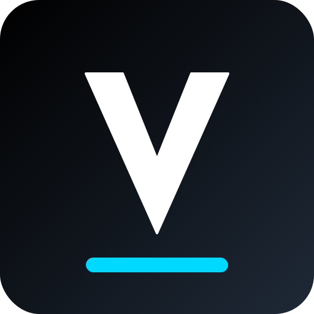

# Vach Systems Logo - Verwendung

## 📁 Verfügbare Versionen

### **1. favicon.svg** (32×32px)
- **Verwendung:** Website Favicon, kleine Icons
- **Location:** `vach-systems/favicon.svg`

### **2. logo-large.svg** (512×512px) ✨ NEU
- **Verwendung:** Print, Präsentationen, Social Media, große Displays
- **Location:** `vach-systems/logo-large.svg`

---

## 🎨 Design

**Farben:**
- Hintergrund: Gradient #000000 → #1F2937 (Schwarz zu Anthrazit)
- V-Logo: #FFFFFF (Weiß)
- Akzent-Bar: #00D9FF (Cyan)

**Elemente:**
- Abgerundetes Quadrat (Border-Radius: 12.5%)
- Weißes "V" mittig (mit Stroke für bessere Sichtbarkeit)
- Cyan-Bar am unteren Rand

---

## 📤 Als PNG exportieren (für E-Mail, PDF, Print)

### **Option 1: Browser**
1. Öffne `logo-large.svg` in Chrome/Edge
2. Rechtsklick → "Speichern unter..." → Als PNG speichern

### **Option 2: Online Tool**
1. Gehe zu https://svgtopng.com/
2. Upload `logo-large.svg`
3. Download als PNG (512×512 oder größer)

### **Option 3: Figma/Photoshop**
1. Importiere SVG
2. Exportiere als PNG (empfohlen: 1024×1024 oder 2048×2048 für Print)

---

## 💡 Verwendungsbeispiele

### **Website Header**
```html

```

### **E-Mail-Signatur**
- Exportiere als PNG (256×256)
- Komprimiere mit TinyPNG
- Einbetten als ``

### **Visitenkarten / Print**
- Exportiere als PNG (2048×2048 oder größer)
- Oder nutze SVG direkt (vektorbasiert, verlustfrei skalierbar)

### **Social Media**
- LinkedIn/Twitter Header: 1500×500 (Logo links platzieren)
- Profilbild: 400×400 (PNG aus logo-large.svg)

---

## 🔧 Größen-Empfehlungen

| Verwendung | Empfohlene Größe |
|------------|------------------|
| Favicon | 32×32, 64×64 |
| Website Header | 48×48 bis 128×128 |
| E-Mail | 256×256 |
| Social Media Profilbild | 400×400 |
| Print / Visitenkarte | 1024×1024 oder höher |
| Banner / Hero | 2048×2048 |

---

## ✅ Dateien im Ordner

```
vach-systems/
├── favicon.svg          (32×32 - klein)
├── logo-large.svg       (512×512 - groß) ✨ NEU
└── LOGO-INFO.md         (diese Datei)
```

---

**Brauchst du andere Formate oder Größen?**
- Transparenter Hintergrund? (PNG ohne schwarzen Square)
- Andere Farben? (z.B. weißes Logo auf transparentem Hintergrund)
- Rechteckiges Format? (z.B. 16:9 für Präsentationen)

Sag Bescheid! 🎨
